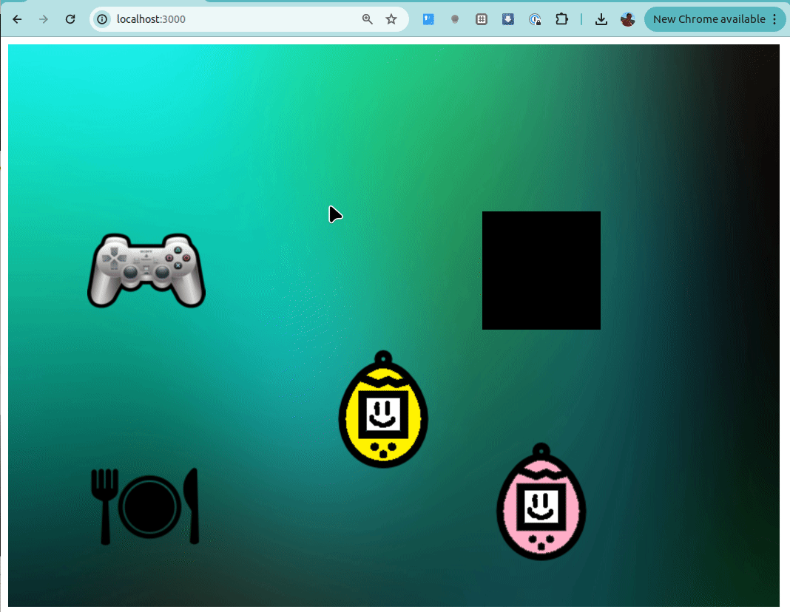

# Tamagotchi
 

### ¡Juegue al legendario Tamagotchi de la mano de Wollok!

## Controles
- Usá las **flechas** para mover al Tamagotchi

- Cuando estés arriba de un objeto presiona **espacio** para interactuar con él

## ¿Cómo jugar?

| Elemento | Qué hace |
| ------- | ------- |
|  | El joystick hace **jugar** al Tamagotchi |
|  | El plato hace **comer** al Tamagotchi |
|  | El pozo depresivo pone **triste** al Tamagotchi |
|  | La compañera hace que el Tamagotchi **juegue con ella** |

----------

### DESAFÍO

#### Les dejamos el [enunciado de este ejercicio](https://docs.google.com/document/d/1jLvvIVhdqvE8F7HOyfrOz_fpYe8L7NKWC_fDKYup_2I/edit) y los desafiamos a agregar la parte BONUS al juego!
